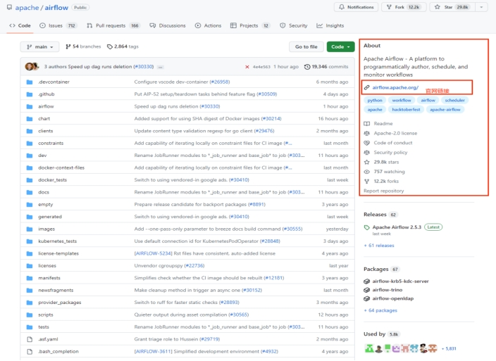
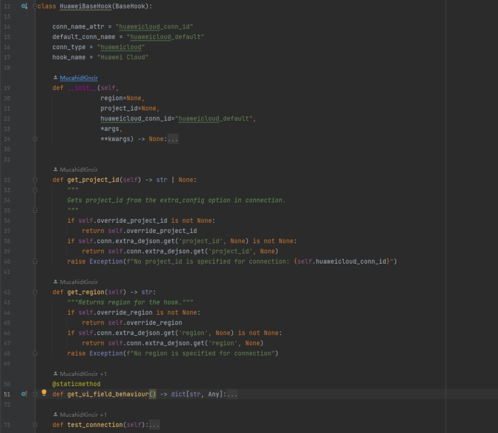
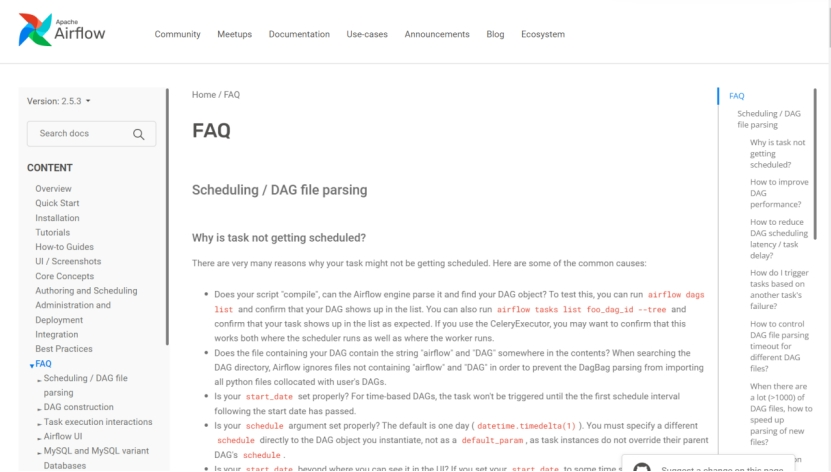
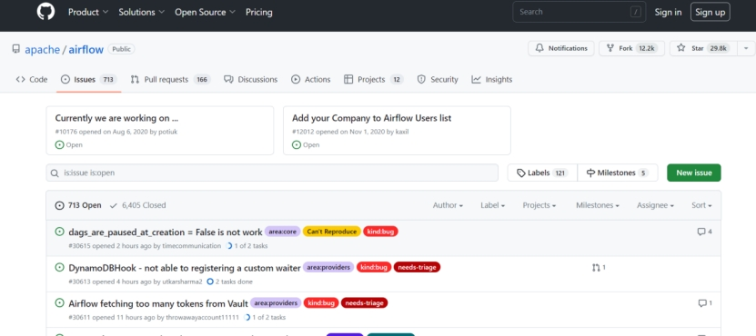

## **开源项目Airflow扩展**

### 1. **如何入手**

首先，肯定是了解开源项目是干什么的？找到Github上开源项目源码，如下图所示，右侧About部分会简要介绍项目，也可能直接提供官方文档链接。在当前页面下方，通常会有项目自述文件README，会提供项目的安装指南、操作指南等信息，也可以通过官方文档查看。

 

### 2. **项目部署**

了解完项目基本功能，就可以开始尝试部署开源项目了。为了扩展Airflow，采用源码部署的方式。从Github拉取Airflow源码，由于官方文档中没有提供源码部署的详细资料，需要仔细阅读项目根目录下的INSTALL文件，根据当前源码安装部署Airflow。

**部署完成后启动服务后Web界面无法加载静态页面**

```
原因：未仔细阅读INSTALL文件，安装Airflow前没有编译前端代码
解决方法：编译前端代码再启用安装命令
```

### 3. **需求分析**

需求是对接华为云服务扩展Airflow的provider包。由于是初次接触Airflow，可以参考各友商功能实现，比如华为云的对象存储服务OBS，对标AWS的S3、Alibaba的OSS等。分析友商提供的provider包，列出每一个云服务对接Airflow实现的功能，随后根据功能列出对应云服务的SDK或者API，用以评估功能实现的可能性，如下以OBS为例：

| 任务类型                       | 功能                        | SDK                      |
| ------------------------------ | --------------------------- | ------------------------ |
| OBSCreateBucketOperator        | 创建OBS桶                   | createBucket             |
| OBSListBucketOperator          | 列举OBS桶                   | listBuckets              |
| OBSDeleteBucketOperator        | 删除OBS桶                   | deleteBucket             |
| OBSListBucketObjectsOperator   | 列举OBS桶中对象             | listObjects              |
| OBSGetBucketTaggingOperator    | 获取OBS桶标签               | getBucketTagging         |
| OBSSetBucketTaggingOperator    | 设置OBS桶标签               | setBucketTagging         |
| OBSDeleteBucketTaggingOperator | 删除OBS桶标签               | deleteBucketTagging      |
| OBSCreateObjectOperator        | 上传对象到OBS桶             | putContent, putFile      |
| OBSGetObjectOperator           | 从OBS桶下载对象             | getObject                |
| OBSCopyObjectOperator          | 复制OBS桶对象               | copyObject               |
| OBSDeleteObjectOperator        | 删除OBS桶对象               | deleteObject             |
| OBSDeleteBatchObjectOperator   | 批量删除OBS桶对象           | deleteObjects            |
| OBSMoveObjectOperator          | 移动OBS桶对象               | copyObject, deleteObject |
| OBSObjectKeySensor             | 等待单个或多个OBS桶对象存在 | headObject               |

```
问题：华为云服务的SDK或API没有提供移动OBS桶对象功能
解决方法：使用copyObject，deleteObject接口，并向华为云客服反馈

问题：华为云服务的文档没有提供判断对象是否存在的功能
解决方法：结合SDK源码查看文档，SDK源码中存在功能实现headObject。
```


### 4. **开发**

开发前，需要仔细阅读源码根目录下的CONTRBUTING文件，一般会提供参与开源项目的要求，开发环境的搭建、编码的风格、测试环境的搭建等内容。

了解上述内容后，从华为云官方文档中获取云服务的SDK包，就可以进行开发啦。

当开发第二个云服务时，发现诸多重复代码，如此时可以创建一个公共类提高开发效率。

 

```
问题：执行airflow db upgrade报错：alembic.util.exc.CommandError: Can't locate revision identified by '290244fb8b83'
解决方法：将数据表alembic_version中版本'290244fb8b83'数据删除

问题：任务实例中数据传输失败
原因：Airflow在任务实例中传输的机制Xcom会使用JSON格式序列化数据，而JSON格式无法序列化日期、SDK中的自定义类
解决方法：将不符合序列化的返回值转换为基本数据类型
```


### 5. **测试**

编写单元测试类需要熟悉Mock模块，因为使用云资源会产生费用，所以单元测试是采用mock模拟数据的方式来实现。

编写测试用例时可参考华为云服务文档的最佳实践，如从OBS导入数据到集群，使用到OBS与DWS的功能。https://support.huaweicloud.com/bestpractice-dws/dws_05_0024.html

修改代码后记得修改注释，防止产生歧义。

### 6. **问题处理方式**

\1. 官方文档[https://airflow.apache.org/docs/apache-airflow/stable/faq.html#faq](#faq)

 

\2. ISSUE搜索 https://github.com/apache/airflow/issues

 

\3. 百度、B站、YouTube等等方式。